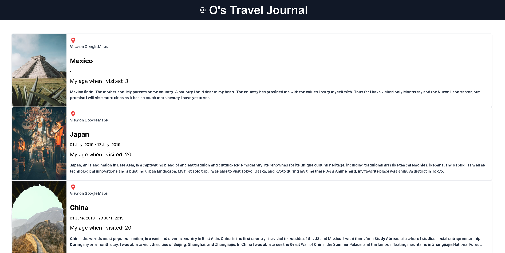

# Travel Journal

## Description

A personal journal dedicated to my travels.

## Business Case

Documents every country I've been with the options to view a gallery from each country, I am a traveler at heart so I decided to develop this application to keep track.

## Table of Contents

- [Features](#features)
- [Contributors](#contributors)
- [Technologies](#technologies)
- [License](#license)
- [UI](#ui)
- [LiveSite](#livesite)

## Features

When Accessed:

Can view all countries I have been to.

## Contributors

This application was developed by the following contributors:

- [Oscar Leal](https://github.com/Oscarl214)

## UI

## Technologies

This personal project was built using the following:

- Node.js
- React.js
- CSS
- TailWind

## License

    This app is licensed under the MIT license.

## LiveSite

Coming Soon.
